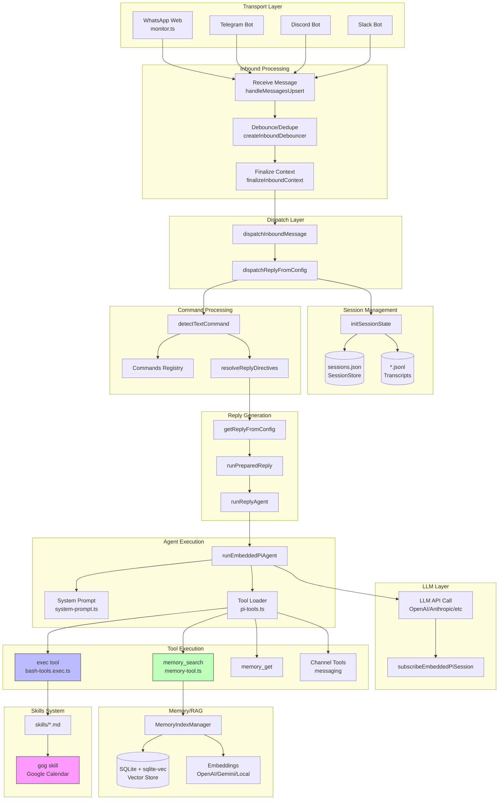

# OpenClaw Chat Command Flow: "look up my calendar"

## Transport Traced: WhatsApp Web Adapter

I traced the **WhatsApp Web adapter** (`src/web/inbound/monitor.ts`) as the primary "chat client connected" transport. The architecture is identical for Discord, Telegram, Slack, and other adapters (they all converge at `dispatchInboundMessage`).

---

## High-Level Flow (18 Steps)

| Step | Stage | File | Key Symbol |
|------|-------|------|------------|
| 1 | **Gateway Start** | [server.impl.ts](src/gateway/server.impl.ts) | `startGatewayServer()` |
| 2 | **Channel Monitor Boot** | [monitor.ts](src/web/inbound/monitor.ts) | `monitorWebInbox()` |
| 3 | **Message Receive** | [monitor.ts](src/web/inbound/monitor.ts#L139) | `handleMessagesUpsert()` |
| 4 | **Build Inbound Context** | [monitor.ts](src/web/inbound/monitor.ts) | `WebInboundMessage` type |
| 5 | **Debounce/Dedupe** | [inbound-debounce.ts](src/auto-reply/inbound-debounce.ts) | `createInboundDebouncer()` |
| 6 | **Dispatch Inbound** | [dispatch.ts](src/auto-reply/dispatch.ts) | `dispatchInboundMessage()` |
| 7 | **Finalize Context** | [inbound-context.ts](src/auto-reply/reply/inbound-context.ts) | `finalizeInboundContext()` |
| 8 | **Session Init** | [session.ts](src/auto-reply/reply/session.ts) | `initSessionState()` |
| 9 | **Command Detection** | [commands-registry.ts](src/auto-reply/commands-registry.ts) | `detectTextCommand()` |
| 10 | **Directive Parsing** | [get-reply-directives.ts](src/auto-reply/reply/get-reply-directives.ts) | `resolveReplyDirectives()` |
| 11 | **Get Reply** | [get-reply.ts](src/auto-reply/reply/get-reply.ts) | `getReplyFromConfig()` |
| 12 | **Run Prepared Reply** | [get-reply-run.ts](src/auto-reply/reply/get-reply-run.ts) | `runPreparedReply()` |
| 13 | **Agent Runner** | [agent-runner.ts](src/auto-reply/reply/agent-runner.ts) | `runReplyAgent()` |
| 14 | **LLM Invocation** | [run.ts](src/agents/pi-embedded-runner/run.ts) | `runEmbeddedPiAgent()` |
| 15 | **Tool Execution** | [pi-tools.ts](src/agents/pi-tools.ts) | `createOpenClawCodingTools()` |
| 16 | **Memory/RAG Search** | [memory-tool.ts](src/agents/tools/memory-tool.ts) | `memory_search` tool |
| 17 | **Subscribe to Stream** | [pi-embedded-subscribe.ts](src/agents/pi-embedded-subscribe.ts) | `subscribeEmbeddedPiSession()` |
| 18 | **Send Reply** | [dispatch-from-config.ts](src/auto-reply/reply/dispatch-from-config.ts) | `dispatcher.queue()` |

---

## Stage-by-Stage Details

### 1. Gateway Start — Entry Point

**File:** `src/gateway/server.impl.ts`

```typescript
export async function startGatewayServer(
  port = 18789,
  opts: GatewayServerOptions = {},
): Promise<GatewayServer> {
  // Ensure all default port derivations (browser/canvas) see the actual runtime port.
  process.env.OPENCLAW_GATEWAY_PORT = String(port);
  // ... config loading, migration, plugin loading ...
  
  // Start channel monitors (WhatsApp, Discord, Telegram, etc.)
  const channelManager = createChannelManager();
  await startGatewaySidecars({ channelManager, ...opts });
  
  return { close: ... };
}
```

**Input:** CLI args, environment, config  
**Output:** Running gateway with all channel connections active

---

### 2. WhatsApp Inbound Monitor

**File:** `src/web/inbound/monitor.ts`

```typescript
export async function monitorWebInbox(options: {
  verbose: boolean;
  accountId: string;
  authDir: string;
  onMessage: (msg: WebInboundMessage) => Promise<void>;
  mediaMaxMb?: number;
  sendReadReceipts?: boolean;
  debounceMs?: number;
  shouldDebounce?: (msg: WebInboundMessage) => boolean;
}) {
  const sock = await createWaSocket(false, options.verbose, {
    authDir: options.authDir,
  });
  await waitForWaConnection(sock);
  
  // Listen for messages via Baileys library
  sock.ev.on("messages.upsert", handleMessagesUpsert);
}
```

**Input:** WhatsApp auth credentials, config  
**Output:** Connected WebSocket listener for incoming messages

---

### 3. Message Receive Handler

**File:** `src/web/inbound/monitor.ts` (line ~139)

```typescript
const handleMessagesUpsert = async (upsert: { type?: string; messages?: Array<WAMessage> }) => {
  if (upsert.type !== "notify" && upsert.type !== "append") {
    return;
  }
  for (const msg of upsert.messages ?? []) {
    recordChannelActivity({ channel: "whatsapp", accountId, direction: "inbound" });
    
    const id = msg.key?.id ?? undefined;
    const remoteJid = msg.key?.remoteJid;
    // Extract text, media, metadata...
    const body = extractText(msg.message) ?? "";
    const locationData = extractLocationData(msg.message);
    const mediaPlaceholder = extractMediaPlaceholder(msg.message);
    
    // Build WebInboundMessage and dispatch
    const inboundMessage: WebInboundMessage = {
      id, from, body, chatId, chatType, senderE164, senderName, accountId, /* ... */
    };
    debouncer.add(inboundMessage);
  }
};
```

**Input:** Raw WAMessage from Baileys  
**Output:** `WebInboundMessage` object

---

### 4. `WebInboundMessage` Type (Data Model)

**File:** `src/web/inbound/types.ts`

```typescript
export type WebInboundMessage = {
  id?: string;
  from: string;
  body: string;
  chatId?: string;
  chatType: "direct" | "group";
  senderE164?: string | null;
  senderName?: string;
  senderJid?: string;
  accountId: string;
  mentionedJids?: string[];
  mediaPath?: string;
  mediaUrl?: string;
  mediaType?: string;
  groupSubject?: string;
  groupParticipants?: string[];
  reply: (content: string | AnyMessageContent, opts?: ReplyOptions) => Promise<...>;
};
```

---

### 5. Debounce & Dedupe

**File:** `src/auto-reply/inbound-debounce.ts`

```typescript
export function createInboundDebouncer<T>(options: {
  debounceMs: number;
  buildKey: (msg: T) => string | null;
  shouldDebounce?: (msg: T) => boolean;
  onFlush: (entries: T[]) => Promise<void>;
  onError: (error: unknown) => void;
}) {
  // Batches rapid consecutive messages from same sender
  // Uses key: `${accountId}:${conversationKey}:${senderKey}`
  return {
    add: (msg: T) => { /* queue and schedule flush */ },
  };
}
```

**Input:** Stream of `WebInboundMessage`  
**Output:** Batched/deduplicated messages to `onMessage` callback

---

### 6. Dispatch Inbound Message

**File:** `src/auto-reply/dispatch.ts`

```typescript
export async function dispatchInboundMessage(params: {
  ctx: MsgContext | FinalizedMsgContext;
  cfg: OpenClawConfig;
  dispatcher: ReplyDispatcher;
  replyOptions?: GetReplyOptions;
  replyResolver?: typeof getReplyFromConfig;
}): Promise<DispatchInboundResult> {
  const finalized = finalizeInboundContext(params.ctx);
  return await dispatchReplyFromConfig({
    ctx: finalized,
    cfg: params.cfg,
    dispatcher: params.dispatcher,
    replyOptions: params.replyOptions,
    replyResolver: params.replyResolver,
  });
}
```

**Input:** `MsgContext` (raw), config, dispatcher  
**Output:** `DispatchInboundResult` with queued replies

---

### 7. Finalize Inbound Context

**File:** `src/auto-reply/reply/inbound-context.ts`

```typescript
export function finalizeInboundContext<T extends Record<string, unknown>>(
  ctx: T,
  opts: FinalizeInboundContextOptions = {},
): T & FinalizedMsgContext {
  const normalized = ctx as T & MsgContext;
  
  // Normalize newlines, chat type, body fields
  normalized.Body = normalizeInboundTextNewlines(normalized.Body ?? "");
  normalized.ChatType = normalizeChatType(normalized.ChatType);
  normalized.BodyForAgent = normalizeInboundTextNewlines(normalized.BodyForAgent);
  normalized.BodyForCommands = normalizeInboundTextNewlines(normalized.BodyForCommands);
  
  // Default-deny auth
  normalized.CommandAuthorized = normalized.CommandAuthorized === true;
  
  return normalized as T & FinalizedMsgContext;
}
```

**Input:** Raw `MsgContext`  
**Output:** `FinalizedMsgContext` with normalized fields

---

### 8. Session Initialization

**File:** `src/auto-reply/reply/session.ts`

```typescript
export async function initSessionState(params: {
  ctx: MsgContext;
  cfg: OpenClawConfig;
  commandAuthorized: boolean;
}): Promise<SessionInitResult> {
  const storePath = resolveStorePath(sessionCfg?.store, { agentId });
  const sessionStore: Record<string, SessionEntry> = loadSessionStore(storePath);
  
  // Resolve or create session key
  let sessionKey = resolveSessionKey(ctx, { mainKey, scope: sessionScope });
  let sessionEntry = sessionStore[sessionKey.toLowerCase()];
  
  if (!sessionEntry) {
    sessionEntry = { sessionId: crypto.randomUUID(), updatedAt: Date.now() };
    isNewSession = true;
  }
  
  // Check reset triggers like "/reset", "/new"
  const resetTriggered = checkResetTriggers(triggerBodyNormalized, resetTriggers);
  
  return { sessionCtx, sessionEntry, sessionKey, sessionId, isNewSession, resetTriggered, ... };
}
```

**Input:** `MsgContext`, config  
**Output:** `SessionInitResult` with session state

**Session Storage:** JSON file at `~/.openclaw/agents/<agentId>/sessions.json`

---

### 9. Command Detection

**File:** `src/auto-reply/commands-registry.ts`

```typescript
export function detectTextCommand(
  body: string,
  opts?: CommandNormalizeOptions,
): CommandDetection | null {
  const textAliasMap = getTextAliasMap();  // Map of "/status" -> { key: "status", ... }
  
  // Parse first token as potential command
  const match = body.match(/^\/(\S+)/);
  if (!match) return null;
  
  const alias = textAliasMap.get(match[1].toLowerCase());
  if (alias) {
    return { commandKey: alias.key, canonical: alias.canonical, args: parseArgs(...) };
  }
  return null;
}
```

**Command Registry:** Defined in `src/auto-reply/commands-registry.data.ts`

```typescript
// Examples: /status, /reset, /model, /think, /tts, /image, /bash, etc.
```

---

### 10. Reply Directive Resolution

**File:** `src/auto-reply/reply/get-reply-directives.ts`

Parses inline directives like `@model:gpt-4`, `@think:high`, `@verbose:on` from the message body.

---

### 11. Get Reply From Config

**File:** `src/auto-reply/reply/get-reply.ts`

```typescript
export async function getReplyFromConfig(
  ctx: MsgContext,
  opts?: GetReplyOptions,
  configOverride?: OpenClawConfig,
): Promise<ReplyPayload | ReplyPayload[] | undefined> {
  const cfg = configOverride ?? loadConfig();
  const agentId = resolveSessionAgentId({ sessionKey, config: cfg });
  
  // Resolve model, workspace, timeout
  const { defaultProvider, defaultModel } = resolveDefaultModel({ cfg, agentId });
  const workspace = await ensureAgentWorkspace({ dir: workspaceDirRaw });
  
  // Apply media/link understanding
  await applyMediaUnderstanding({ ctx: finalized, cfg, agentDir, activeModel });
  await applyLinkUnderstanding({ ctx: finalized, cfg });
  
  // Init session state and get reply
  const sessionState = await initSessionState({ ctx: finalized, cfg, commandAuthorized });
  const directiveResult = await resolveReplyDirectives({ ctx, cfg, agentId, ... });
  
  return await runPreparedReply({ ... });
}
```

---

### 12-13. Run Prepared Reply & Agent Runner

**File:** `src/auto-reply/reply/get-reply-run.ts` → `src/auto-reply/reply/agent-runner.ts`

```typescript
export async function runReplyAgent(params: {
  commandBody: string;
  followupRun: FollowupRun;
  sessionCtx: TemplateContext;
  /* ... */
}): Promise<ReplyPayload | ReplyPayload[] | undefined> {
  // Execute agent turn with model fallback
  const result = await runAgentTurnWithFallback({
    commandBody,
    followupRun,
    sessionCtx,
    // ...
  });
  
  // Build reply payloads from agent results
  return buildReplyPayloads({ runResult: result.runResult, ... });
}
```

---

### 14. LLM Invocation — The Core

**File:** `src/agents/pi-embedded-runner/run.ts`

```typescript
export async function runEmbeddedPiAgent(
  params: RunEmbeddedPiAgentParams,
): Promise<EmbeddedPiRunResult> {
  // Resolve model and auth
  const { model, authStorage, modelRegistry } = resolveModel(provider, modelId, agentDir, cfg);
  
  // Build payloads (system prompt, tools, context)
  const payloads = await buildEmbeddedRunPayloads({
    sessionFile,
    prompt,
    workspaceDir,
    config,
    tools: createOpenClawCodingTools({ ... }),
    systemPromptOverride,
    /* ... */
  });
  
  // Execute the attempt (LLM API call)
  runResult = await runEmbeddedAttempt({
    provider,
    model: modelId,
    apiKey: apiKeyInfo.apiKey,
    baseUrl: apiKeyInfo.baseUrl,
    payloads,
    onStreamUpdate: subscribeEmbeddedPiSession({ ... }),
  });
  
  return runResult;
}
```

**Input:** Prompt, session file, tools, model config  
**Output:** `EmbeddedPiRunResult` with assistant response and tool calls

---

### 15. Tool System (for Calendar Lookup)

**File:** `src/agents/pi-tools.ts`

```typescript
export function createOpenClawCodingTools(options?: {
  sandbox?: SandboxContext;
  config?: OpenClawConfig;
  modelProvider?: string;
  /* ... */
}): AnyAgentTool[] {
  const tools: AnyAgentTool[] = [];
  
  // Core coding tools (read, write, exec, apply_patch)
  tools.push(createExecTool({ ... }));        // Bash execution
  tools.push(createOpenClawReadTool({ ... })); // File reading
  
  // Memory tools (RAG)
  const memorySearch = createMemorySearchTool({ config, agentSessionKey });
  const memoryGet = createMemoryGetTool({ config, agentSessionKey });
  
  // OpenClaw tools (sessions, messaging, agents)
  tools.push(...createOpenClawTools({ ... }));
  
  // Channel tools (send messages)
  tools.push(...listChannelAgentTools({ ... }));
  
  // Filter by policy
  return filterToolsByPolicy(tools, effectivePolicy);
}
```

**Calendar lookup** uses the **`exec` tool** to run shell commands like:
```bash
gog calendar events <calendarId> --from <iso> --to <iso>
```

The `gog` skill (`skills/gog/SKILL.md`) provides Google Calendar CLI access.

**File:** `src/agents/bash-tools.exec.ts`

```typescript
export function createExecTool(options: ExecToolDefaults): AgentTool {
  return {
    name: "exec",
    description: "Execute a shell command",
    parameters: Type.Object({
      command: Type.String(),
      background: Type.Optional(Type.Boolean()),
      timeout_ms: Type.Optional(Type.Number()),
    }),
    execute: async (toolCallId, params) => {
      // Validate command against allowlist/blocklist
      const { allowed, reason } = evaluateShellAllowlist(command, security);
      
      // Spawn process
      const result = await spawnWithFallback(shell, ["-c", command], { cwd, env, timeout });
      
      return { stdout, stderr, exitCode };
    },
  };
}
```

---

### 16. Memory/RAG System

**File:** `src/agents/tools/memory-tool.ts`

```typescript
export function createMemorySearchTool(options: {
  config?: OpenClawConfig;
  agentSessionKey?: string;
}): AnyAgentTool | null {
  return {
    name: "memory_search",
    description: "Semantically search MEMORY.md + memory/*.md",
    parameters: MemorySearchSchema,
    execute: async (_toolCallId, params) => {
      const { manager } = await getMemorySearchManager({ cfg, agentId });
      const results = await manager.search(query, { maxResults, minScore });
      return jsonResult({ results, provider: status.provider, model: status.model });
    },
  };
}
```

**Memory Index Manager:** `src/memory/manager.ts`

```typescript
export class MemoryIndexManager {
  // SQLite database with vector extension (sqlite-vec)
  private db: DatabaseSync;
  private provider: EmbeddingProvider;  // OpenAI, Gemini, or local
  
  async search(query: string, opts?: { maxResults?: number; minScore?: number }): Promise<MemorySearchResult[]> {
    // 1. Generate query embedding
    const queryVec = await this.embedQueryWithTimeout(query);
    
    // 2. Vector search (cosine similarity)
    const vectorResults = await this.searchVector(queryVec, candidates);
    
    // 3. Optional: hybrid with BM25 keyword search
    if (hybrid.enabled) {
      const keywordResults = await this.searchKeyword(query, candidates);
      return this.mergeHybridResults({ vector: vectorResults, keyword: keywordResults });
    }
    
    return vectorResults.filter(r => r.score >= minScore).slice(0, maxResults);
  }
}
```

**Vector Store:** SQLite + `sqlite-vec` extension

**Embeddings:** `src/memory/embeddings.ts`
- OpenAI: `text-embedding-3-small`
- Gemini: `text-embedding-004`  
- Local: `node-llama-cpp` with GGUF models

---

### 17. Conversation Memory / Session Storage

**File:** `src/config/sessions/store.ts`

```typescript
export function loadSessionStore(storePath: string): Record<string, SessionEntry> {
  // Load from JSON file with TTL cache
  const raw = fs.readFileSync(storePath, "utf-8");
  return JSON5.parse(raw);
}

export function updateSessionStore(
  storePath: string,
  sessionKey: string,
  update: Partial<SessionEntry>,
): void {
  const store = loadSessionStore(storePath, { skipCache: true });
  store[sessionKey.toLowerCase()] = mergeSessionEntry(store[sessionKey], update);
  fs.writeFileSync(storePath, JSON.stringify(store, null, 2));
}
```

**Session Entry Type:** `src/config/sessions/types.ts`

```typescript
export type SessionEntry = {
  sessionId: string;
  updatedAt: number;
  sessionFile?: string;          // Path to .jsonl transcript
  systemSent?: boolean;
  thinkingLevel?: string;
  modelOverride?: string;
  providerOverride?: string;
  inputTokens?: number;
  outputTokens?: number;
  totalTokens?: number;
  compactionCount?: number;
  // ... more fields
};
```

**Storage Locations:**
- Session index: `~/.openclaw/agents/<agentId>/sessions.json`
- Session transcripts: `~/.openclaw/agents/<agentId>/sessions/*.jsonl` (JSONL format)

---

### 18. Subscribe & Stream Response

**File:** `src/agents/pi-embedded-subscribe.ts`

```typescript
export function subscribeEmbeddedPiSession(params: SubscribeEmbeddedPiSessionParams) {
  const handler = createEmbeddedPiSessionEventHandler(context);
  
  return {
    // Handle streaming text deltas
    onAssistantDelta: (text) => { assistantTexts.push(text); },
    
    // Handle tool calls
    onToolStart: (toolCall) => { toolMetas.push(toolCall); },
    onToolResult: (result) => { params.onToolResult?.(result); },
    
    // Handle block replies (for streaming to chat)
    onBlockReply: (payload) => { params.onBlockReply?.(payload); },
    
    // Handle completion
    onComplete: () => { finalizeAssistantTexts(...); },
  };
}
```

---

## Mermaid Flow Diagram



---

## Calendar Lookup Specific Path

For "look up my calendar":

1. Message arrives → `monitorWebInbox()` → `WebInboundMessage`
2. Dispatch → Session init → No command detected (natural language)
3. `getReplyFromConfig()` → `runEmbeddedPiAgent()`
4. LLM receives system prompt with available tools including `exec`
5. LLM reasons: "calendar lookup → need `gog` skill"
6. LLM calls `exec` tool with: `gog calendar events primary --from <today> --to <tomorrow>`
7. `exec` tool spawns shell, runs command, returns JSON output
8. LLM formats response: "Here are your calendar events for today..."
9. Response streamed back through `subscribeEmbeddedPiSession()`
10. Reply sent via `dispatcher.queue()` → WhatsApp

---

## Key Data Models

### MsgContext (Inbound Message)

```typescript
export type MsgContext = {
  Body?: string;                    // Message text
  BodyForAgent?: string;            // Text for LLM (with context)
  BodyForCommands?: string;         // Clean text for command parsing
  From?: string;                    // Sender identifier
  To?: string;                      // Recipient
  SessionKey?: string;              // Session routing key
  AccountId?: string;               // Provider account
  ChatType?: string;                // "direct" | "group"
  Provider?: string;                // "whatsapp" | "telegram" | ...
  MediaPath?: string;               // Attached media path
  MediaType?: string;               // MIME type
  SenderName?: string;              // Human-readable sender name
  // ... many more fields
};
```

### SessionEntry (Persisted State)

```typescript
export type SessionEntry = {
  sessionId: string;                // UUID
  updatedAt: number;                // Timestamp
  sessionFile?: string;             // Transcript path
  thinkingLevel?: string;           // "off" | "low" | "high"
  modelOverride?: string;           // Per-session model
  providerOverride?: string;        // Per-session provider
  inputTokens?: number;             // Usage tracking
  outputTokens?: number;
  totalTokens?: number;
  compactionCount?: number;         // Context compaction count
};
```

### ReplyPayload (Outbound Message)

```typescript
export type ReplyPayload = {
  text?: string;                    // Reply text
  mediaUrls?: string[];             // Attached media
  audioBuffer?: Buffer;             // Voice message
  channel?: string;                 // Target channel
  to?: string;                      // Target recipient
  threadId?: string | number;       // Thread for reply
};
```

---

## Open Questions

| Item | Status | Notes |
|------|--------|-------|
| **Calendar tool detection** | ✅ Found | Uses `gog` CLI skill via `exec` tool, not a dedicated calendar API |
| **Vector store type** | ✅ Found | SQLite + `sqlite-vec` extension (hybrid BM25 + vector) |  
| **Embeddings provider** | ✅ Found | OpenAI `text-embedding-3-small`, Gemini, or local GGUF |
| **Session persistence** | ✅ Found | JSON sessions.json + JSONL transcripts |
| **Tool policy/gating** | ✅ Found | `src/agents/pi-tools.policy.ts` |
| **MCP integration** | NOT FOUND | Search for `mcp` shows references but no full MCP server implementation in core |
| **Structured tool schemas** | ✅ Found | Typebox schemas in tool files |

---

## File Reference Index

| Component | Primary Files |
|-----------|---------------|
| Gateway | `src/gateway/server.impl.ts`, `src/gateway/server-channels.ts` |
| WhatsApp | `src/web/inbound/monitor.ts`, `src/web/inbound/types.ts` |
| Dispatch | `src/auto-reply/dispatch.ts`, `src/auto-reply/reply/dispatch-from-config.ts` |
| Session | `src/auto-reply/reply/session.ts`, `src/config/sessions/store.ts` |
| Commands | `src/auto-reply/commands-registry.ts`, `src/auto-reply/commands-registry.data.ts` |
| Reply | `src/auto-reply/reply/get-reply.ts`, `src/auto-reply/reply/agent-runner.ts` |
| Agent | `src/agents/pi-embedded-runner/run.ts`, `src/agents/pi-embedded-subscribe.ts` |
| Tools | `src/agents/pi-tools.ts`, `src/agents/bash-tools.exec.ts` |
| Memory | `src/memory/manager.ts`, `src/agents/tools/memory-tool.ts` |
| Embeddings | `src/memory/embeddings.ts`, `src/memory/embeddings-openai.ts` |
| Skills | `skills/gog/SKILL.md` (Google Calendar) |
