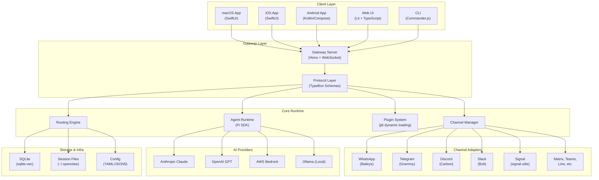
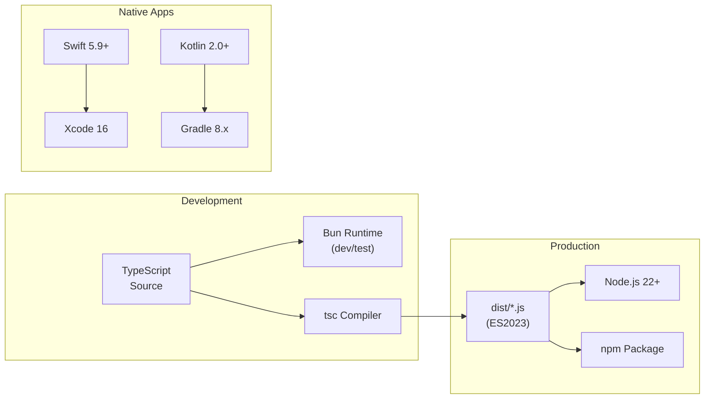
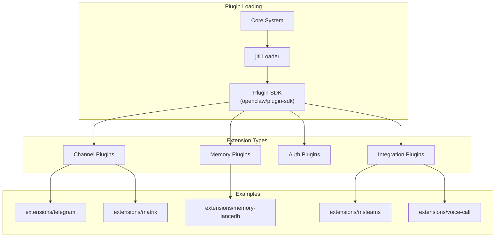
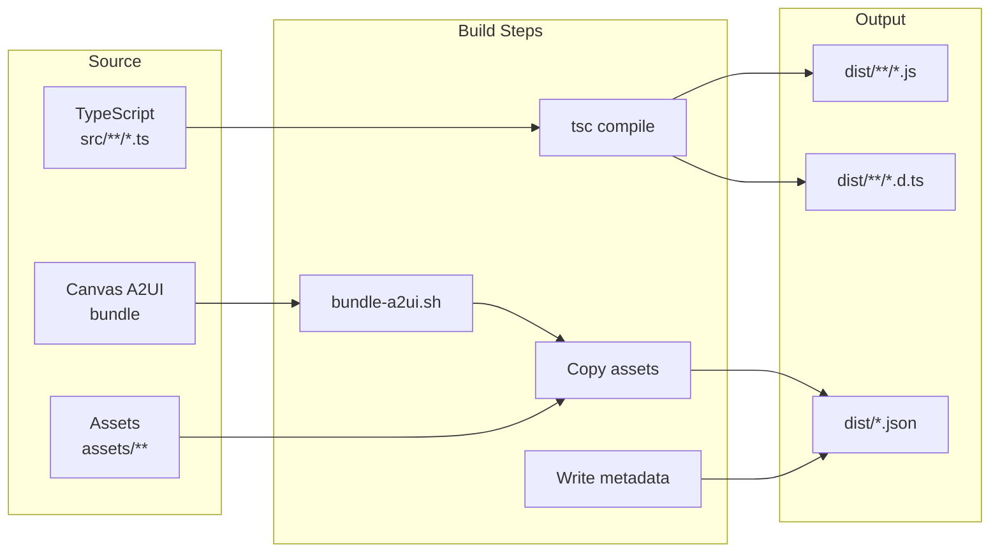

# OpenClaw Technology Stack Blueprint

> **Generated:** 2026-02-07  
> **Version:** 2026.1.30  
> **Depth Level:** Implementation-Ready  
> **Product:** OpenClaw - Multi-Channel AI Agent Gateway

---

## Table of Contents

1. [Executive Summary](#1-executive-summary)
2. [Technology Stack Diagrams](#2-technology-stack-diagrams)
3. [Core Runtime & Language](#3-core-runtime--language)
4. [Framework & Library Inventory](#4-framework--library-inventory)
5. [Native Platform Technologies](#5-native-platform-technologies)
6. [Development Toolchain](#6-development-toolchain)
7. [Testing Framework](#7-testing-framework)
8. [Build & Deployment Pipeline](#8-build--deployment-pipeline)
9. [External Services & Integrations](#9-external-services--integrations)
10. [Implementation Templates](#10-implementation-templates)
11. [Security Stack](#11-security-stack)
12. [Version Matrix](#12-version-matrix)

---

## 1. Executive Summary

### 1.1 Technology Philosophy

OpenClaw follows a **modern TypeScript-first** approach with:
- **Strict typing** throughout the codebase
- **ESM modules** as the primary module format
- **Plugin-based architecture** for extensibility
- **Multi-platform support** via native apps (Swift/Kotlin)

### 1.2 Key Technology Decisions

| Decision | Choice | Rationale |
|----------|--------|-----------|
| Primary Runtime | Node.js 22+ | LTS stability, broad ecosystem |
| Dev Runtime | Bun | Fast TypeScript execution, testing |
| Package Manager | pnpm 10.x | Workspace support, efficient storage |
| Type System | TypeScript 5.9+ strict | Type safety, developer experience |
| Schema Validation | Zod + TypeBox | Runtime validation, JSON Schema |
| AI Framework | Pi SDK + Vercel AI | Agent orchestration, model abstraction |
| Testing | Vitest + V8 Coverage | Fast, ESM-native, 70% threshold |
| Linting | oxlint + oxfmt | Fast Rust-based tooling |

---

## 2. Technology Stack Diagrams

### 2.1 Full Stack Overview



### 2.2 Runtime Architecture



### 2.3 Plugin Architecture



---

## 3. Core Runtime & Language

### 3.1 Node.js Configuration

| Property | Value | Notes |
|----------|-------|-------|
| **Minimum Version** | 22.12.0 | engines field in package.json |
| **Module System** | ESM (type: "module") | Native ES modules |
| **Target** | ES2023 | Modern JavaScript features |

```jsonc
// tsconfig.json core settings
{
  "compilerOptions": {
    "target": "es2023",
    "module": "NodeNext",
    "moduleResolution": "NodeNext",
    "lib": ["DOM", "DOM.Iterable", "ES2023", "ScriptHost"],
    "strict": true,
    "esModuleInterop": true,
    "skipLibCheck": true,
    "resolveJsonModule": true
  }
}
```

### 3.2 TypeScript Standards

```typescript
// Strict mode enforcement
// - noImplicitAny: true (via strict)
// - strictNullChecks: true (via strict)
// - strictFunctionTypes: true (via strict)

// Preferred patterns:
// ✅ Explicit typing for function parameters
function processMessage(msg: IncomingMessage): Promise<Response> { }

// ✅ Zod for runtime validation
const ConfigSchema = z.object({
  provider: z.enum(['anthropic', 'openai', 'bedrock']),
  apiKey: z.string().min(1),
});

// ✅ TypeBox for JSON Schema generation
const MessageSchema = Type.Object({
  id: Type.String(),
  content: Type.String(),
  timestamp: Type.Number(),
});

// ❌ Avoid
// - any type (use unknown + type guards instead)
// - Type assertions without validation
// - Non-null assertions (!) without clear justification
```

### 3.3 Bun Development Runtime

```bash
# Bun is preferred for development tasks
bun <file.ts>           # Execute TypeScript directly
bunx <tool>             # Run npm binaries
bun test                # Fast test execution

# Node remains for production
node dist/index.js      # Production runtime
npm install -g openclaw # Global installation
```

---

## 4. Framework & Library Inventory

### 4.1 Core Dependencies

| Package | Version | Purpose | Category |
|---------|---------|---------|----------|
| `@mariozechner/pi-coding-agent` | 0.50.7 | AI agent core framework | AI |
| `@mariozechner/pi-agent-core` | 0.50.9 | Agent runtime primitives | AI |
| `@mariozechner/pi-ai` | 0.50.9 | AI model abstraction | AI |
| `@mariozechner/pi-tui` | 0.50.7 | Terminal UI components | UI |
| `zod` | ^4.3.6 | Schema validation | Validation |
| `@sinclair/typebox` | 0.34.48 | JSON Schema types | Validation |
| `commander` | ^14.0.3 | CLI framework | CLI |
| `@clack/prompts` | ^1.0.0 | Interactive prompts | CLI |
| `hono` | 4.11.7 | HTTP framework | Server |
| `ws` | ^8.19.0 | WebSocket support | Server |
| `express` | ^5.2.1 | HTTP middleware | Server |

### 4.2 Channel SDKs

| Package | Version | Channel | Notes |
|---------|---------|---------|-------|
| `@whiskeysockets/baileys` | 7.0.0-rc.9 | WhatsApp | Multi-device web protocol |
| `grammy` | ^1.39.3 | Telegram | Bot API framework |
| `@buape/carbon` | 0.14.0 | Discord | Bot framework |
| `@slack/bolt` | ^4.6.0 | Slack | Events API |
| `@slack/web-api` | ^7.13.0 | Slack | Web API client |
| `@line/bot-sdk` | ^10.6.0 | LINE | Messaging API |
| `signal-utils` | ^0.21.1 | Signal | Signal protocol utilities |

### 4.3 AI & ML

| Package | Version | Purpose |
|---------|---------|---------|
| `@aws-sdk/client-bedrock` | ^3.980.0 | AWS Bedrock models |
| `pdfjs-dist` | ^5.4.530 | PDF parsing for context |
| `@mozilla/readability` | ^0.6.0 | Web content extraction |
| `linkedom` | ^0.18.12 | DOM parsing |
| `sharp` | ^0.34.5 | Image processing |

### 4.4 Infrastructure

| Package | Version | Purpose |
|---------|---------|---------|
| `sqlite-vec` | 0.1.7-alpha.2 | Vector embeddings storage |
| `croner` | ^9.1.0 | Cron scheduling |
| `chokidar` | ^5.0.0 | File watching |
| `proper-lockfile` | ^4.1.2 | File locking |
| `dotenv` | ^17.2.3 | Environment variables |
| `yaml` | ^2.8.2 | YAML parsing |
| `json5` | ^2.2.3 | JSON5 parsing |
| `tar` | 7.5.7 | Archive handling |
| `jiti` | ^2.6.1 | Dynamic TypeScript loading |

### 4.5 Utilities

| Package | Version | Purpose |
|---------|---------|---------|
| `chalk` | ^5.6.2 | Terminal colors |
| `osc-progress` | ^0.3.0 | Progress bars |
| `cli-highlight` | ^2.1.11 | Syntax highlighting |
| `markdown-it` | ^14.1.0 | Markdown parsing |
| `qrcode-terminal` | ^0.12.0 | QR code display |
| `undici` | ^7.19.2 | HTTP client |
| `ajv` | ^8.17.1 | JSON Schema validation |
| `jszip` | ^3.10.1 | ZIP file handling |

---

## 5. Native Platform Technologies

### 5.1 macOS Application

| Technology | Version | Component |
|------------|---------|-----------|
| **Swift** | 5.9+ | Primary language |
| **SwiftUI** | Latest | UI framework |
| **Observation** | iOS 17+ / macOS 14+ | State management |
| **Xcode** | 16+ | IDE & build |
| **SwiftFormat** | Config: .swiftformat | Code formatting |
| **SwiftLint** | Config: .swiftlint.yml | Linting |

```swift
// SwiftUI State Management Pattern (Observation framework)
@Observable
final class GatewayState {
    var isConnected = false
    var activeChannels: [Channel] = []
    var pendingMessages: [Message] = []
}

// Usage in View
struct ContentView: View {
    @Bindable var state: GatewayState
    
    var body: some View {
        // View implementation
    }
}
```

### 5.2 iOS Application

| Technology | Version | Component |
|------------|---------|-----------|
| **Swift** | 5.9+ | Primary language |
| **SwiftUI** | Latest | UI framework |
| **XcodeGen** | Via project.yml | Project generation |
| **Minimum iOS** | 17.0 | Deployment target |

```bash
# iOS build commands
pnpm ios:gen      # Generate Xcode project
pnpm ios:build    # Build for simulator
pnpm ios:run      # Build and launch
pnpm ios:open     # Open in Xcode
```

### 5.3 Android Application

| Technology | Version | Component |
|------------|---------|-----------|
| **Kotlin** | 2.0+ | Primary language |
| **Jetpack Compose** | Latest | UI framework |
| **Gradle** | 8.x | Build system |
| **Minimum SDK** | 26 (Android 8) | Deployment target |

```bash
# Android build commands
pnpm android:assemble  # Build debug APK
pnpm android:install   # Install to device
pnpm android:run       # Install and launch
pnpm android:test      # Run unit tests
```

### 5.4 Shared Native Code

```
apps/
├── shared/
│   └── OpenClawKit/     # Shared Swift package
│       └── Sources/
├── macos/
│   └── Sources/
│       └── OpenClaw/
│           └── Resources/
│               └── Info.plist
├── ios/
│   └── Sources/
│       └── Info.plist
└── android/
    └── app/
        └── build.gradle.kts
```

---

## 6. Development Toolchain

### 6.1 Package Management

```bash
# Primary: pnpm (with workspaces)
pnpm install                    # Install dependencies
pnpm -w add <package>           # Add to root
pnpm --filter <pkg> add <dep>   # Add to specific package

# Package manager version
packageManager: "pnpm@10.23.0"  # Exact version in package.json
```

### 6.2 Linting & Formatting

| Tool | Config File | Purpose |
|------|-------------|---------|
| **oxlint** | tsconfig.oxlint.json | Fast Rust-based linter |
| **oxfmt** | .oxfmt (if exists) | Fast Rust-based formatter |
| **SwiftFormat** | .swiftformat | Swift formatting |
| **SwiftLint** | .swiftlint.yml | Swift linting |

```bash
# Lint commands
pnpm lint           # Run oxlint
pnpm lint:fix       # Auto-fix issues
pnpm lint:swift     # Lint Swift code
pnpm format         # Check formatting
pnpm format:fix     # Fix formatting
pnpm format:all     # Format all (TS + Swift)
```

### 6.3 Git Hooks

```bash
# Pre-commit hooks (via prek)
prek install        # Install git hooks

# Hook behavior (git-hooks/pre-commit):
# - Runs same checks as CI
# - Validates formatting
# - Runs linting
# - Type-checks
```

### 6.4 Development Scripts

```bash
# Core development
pnpm dev                # Run CLI in development
pnpm openclaw           # Run CLI via node
pnpm gateway:dev        # Run gateway (skip channels)
pnpm gateway:watch      # Watch mode for gateway
pnpm tui                # Terminal UI
pnpm tui:dev            # TUI in dev profile

# Building
pnpm build              # TypeScript compile + copy assets
pnpm mac:package        # Package macOS app
pnpm mac:open           # Open built app

# Documentation
pnpm docs:dev           # Local docs server (Mintlify)
pnpm docs:build         # Build docs
```

---

## 7. Testing Framework

### 7.1 Vitest Configuration

```typescript
// vitest.config.ts pattern
import { defineConfig } from 'vitest/config';

export default defineConfig({
  test: {
    include: ['src/**/*.test.ts'],
    exclude: ['dist/**', 'apps/**', '**/vendor/**'],
    coverage: {
      provider: 'v8',
      reporter: ['text', 'lcov'],
      thresholds: {
        lines: 70,
        functions: 70,
        branches: 70,
        statements: 70,
      },
      include: ['src/**/*.ts'],
      exclude: ['src/**/*.test.ts'],
    },
  },
});
```

### 7.2 Test Categories

| Category | Config File | Command | Purpose |
|----------|-------------|---------|---------|
| **Unit** | vitest.unit.config.ts | `pnpm test` | Core logic tests |
| **E2E** | vitest.e2e.config.ts | `pnpm test:e2e` | Integration tests |
| **Live** | vitest.live.config.ts | `pnpm test:live` | Real API tests |
| **Gateway** | vitest.gateway.config.ts | - | Gateway-specific |
| **Extensions** | vitest.extensions.config.ts | - | Plugin tests |

### 7.3 Test Commands

```bash
# Standard testing
pnpm test               # Parallel unit tests
pnpm test:watch         # Watch mode
pnpm test:coverage      # With coverage report

# Specialized tests
pnpm test:e2e           # End-to-end tests
pnpm test:live          # Live API tests (needs keys)
pnpm test:ui            # UI component tests

# Docker-based tests
pnpm test:docker:all           # All Docker tests
pnpm test:docker:live-models   # Model tests in Docker
pnpm test:docker:live-gateway  # Gateway tests in Docker
pnpm test:docker:onboard       # Onboarding E2E
pnpm test:docker:plugins       # Plugin tests
```

### 7.4 Test File Pattern

```typescript
// src/feature/handler.test.ts
import { describe, it, expect, vi } from 'vitest';
import { handleMessage } from './handler.js';

describe('handleMessage', () => {
  it('should process incoming messages', async () => {
    const message = { content: 'test', from: 'user123' };
    const result = await handleMessage(message);
    expect(result.status).toBe('processed');
  });

  it('should handle errors gracefully', async () => {
    const invalidMessage = { content: null };
    await expect(handleMessage(invalidMessage)).rejects.toThrow();
  });
});
```

---

## 8. Build & Deployment Pipeline

### 8.1 Build Process



### 8.2 Build Commands

```bash
# Full build
pnpm build
# Runs:
# 1. pnpm canvas:a2ui:bundle    - Bundle A2UI
# 2. tsc -p tsconfig.json       - Compile TypeScript
# 3. canvas-a2ui-copy.ts        - Copy A2UI assets
# 4. copy-hook-metadata.ts      - Copy hook metadata
# 5. write-build-info.ts        - Write build info

# Pre-pack (for npm publish)
pnpm prepack
# Runs: pnpm build && pnpm ui:build
```

### 8.3 Deployment Platforms

| Platform | Config File | Use Case |
|----------|-------------|----------|
| **Fly.io** | fly.toml, fly.private.toml | Primary hosting |
| **Render** | render.yaml | Alternative hosting |
| **Docker** | Dockerfile | Container deployment |
| **npm** | package.json | Package distribution |

### 8.4 Docker Configuration

```dockerfile
# Dockerfile structure
FROM node:22-slim

# Install system dependencies
RUN apt-get update && apt-get install -y \
    python3 \
    build-essential

# Install pnpm
RUN npm install -g pnpm

WORKDIR /app
COPY package.json pnpm-lock.yaml ./
RUN pnpm install --frozen-lockfile

COPY . .
RUN pnpm build

CMD ["node", "dist/index.js"]
```

### 8.5 Release Process

```bash
# Version locations to update:
# - package.json (CLI version)
# - apps/android/app/build.gradle.kts (versionName/versionCode)
# - apps/ios/Sources/Info.plist (CFBundleShortVersionString/CFBundleVersion)
# - apps/macos/Sources/OpenClaw/Resources/Info.plist
# - docs/install/updating.md (pinned npm version)

# Release channels:
# - stable: tagged releases (vYYYY.M.D), npm dist-tag: latest
# - beta: prerelease (vYYYY.M.D-beta.N), npm dist-tag: beta
# - dev: main branch (no tag)
```

---

## 9. External Services & Integrations

### 9.1 AI Providers

| Provider | SDK/Method | Configuration |
|----------|------------|---------------|
| **Anthropic Claude** | Pi SDK integration | API key in config |
| **OpenAI** | Pi SDK integration | API key in config |
| **AWS Bedrock** | @aws-sdk/client-bedrock | AWS credentials |
| **Ollama** | HTTP API | Local endpoint |

### 9.2 Messaging Platforms

| Platform | Protocol | Authentication |
|----------|----------|----------------|
| **WhatsApp** | Baileys (web) | QR code pairing |
| **Telegram** | Bot API | Bot token |
| **Discord** | Bot API | Bot token |
| **Slack** | Events API + Web API | OAuth tokens |
| **Signal** | Signal protocol | Phone registration |
| **LINE** | Messaging API | Channel tokens |
| **Matrix** | Matrix protocol | Homeserver auth |
| **MS Teams** | Graph API | Azure AD auth |

### 9.3 Infrastructure Services

| Service | Purpose | Configuration |
|---------|---------|---------------|
| **Mintlify** | Documentation hosting | docs.openclaw.ai |
| **GitHub Actions** | CI/CD | .github/workflows/ |
| **1Password** | Secrets management | op CLI integration |

---

## 10. Implementation Templates

### 10.1 CLI Command Template

```typescript
// src/commands/my-command.ts
import { Command } from 'commander';
import { createDefaultDeps } from '../cli/deps.js';
import type { CommandDeps } from '../cli/types.js';

export interface MyCommandOptions {
  verbose?: boolean;
  output?: string;
}

export function createMyCommand(deps: CommandDeps = createDefaultDeps()): Command {
  return new Command('my-command')
    .description('Description of the command')
    .option('-v, --verbose', 'Enable verbose output')
    .option('-o, --output <path>', 'Output path')
    .action(async (options: MyCommandOptions) => {
      await runMyCommand(options, deps);
    });
}

async function runMyCommand(
  options: MyCommandOptions,
  deps: CommandDeps
): Promise<void> {
  const { logger, config } = deps;
  
  if (options.verbose) {
    logger.info('Running in verbose mode');
  }
  
  // Command implementation
}
```

### 10.2 Channel Plugin Template

```typescript
// extensions/my-channel/src/index.ts
import type { ChannelPlugin, PluginContext } from 'openclaw/plugin-sdk';

export interface MyChannelConfig {
  apiKey: string;
  webhookUrl?: string;
}

export const plugin: ChannelPlugin<MyChannelConfig> = {
  name: 'my-channel',
  version: '1.0.0',
  type: 'channel',
  
  async initialize(ctx: PluginContext, config: MyChannelConfig) {
    // Initialize connection
    return {
      async send(message) {
        // Send message implementation
      },
      async receive() {
        // Set up message receiving
      },
      async shutdown() {
        // Cleanup
      },
    };
  },
  
  configSchema: {
    type: 'object',
    properties: {
      apiKey: { type: 'string', minLength: 1 },
      webhookUrl: { type: 'string', format: 'uri' },
    },
    required: ['apiKey'],
  },
};

export default plugin;
```

### 10.3 Tool Definition Template

```typescript
// src/tools/my-tool.ts
import { Type } from '@sinclair/typebox';
import type { Tool, ToolResult } from '../agents/types.js';

// Use stringEnum for enums (not Type.Union)
const ActionEnum = Type.Unsafe<'create' | 'update' | 'delete'>({
  type: 'string',
  enum: ['create', 'update', 'delete'],
});

export const myToolSchema = Type.Object({
  action: ActionEnum,
  target: Type.String({ description: 'Target resource ID' }),
  data: Type.Optional(Type.Record(Type.String(), Type.Unknown())),
});

export const myTool: Tool = {
  name: 'my_tool',
  description: 'Performs an action on a resource',
  schema: myToolSchema,
  
  async execute(params): Promise<ToolResult> {
    const { action, target, data } = params;
    
    switch (action) {
      case 'create':
        return { success: true, result: { id: target } };
      case 'update':
        return { success: true, result: { updated: true } };
      case 'delete':
        return { success: true, result: { deleted: true } };
    }
  },
};
```

### 10.4 Configuration Schema Template

```typescript
// src/config/schemas/my-feature.ts
import { z } from 'zod';

export const MyFeatureConfigSchema = z.object({
  enabled: z.boolean().default(true),
  timeout: z.number().min(0).max(300000).default(30000),
  retries: z.number().int().min(0).max(10).default(3),
  providers: z.array(z.enum(['anthropic', 'openai', 'bedrock'])).min(1),
  advanced: z.object({
    cacheEnabled: z.boolean().default(true),
    maxCacheSize: z.number().default(1000),
  }).optional(),
});

export type MyFeatureConfig = z.infer<typeof MyFeatureConfigSchema>;

// Usage
export function loadMyFeatureConfig(raw: unknown): MyFeatureConfig {
  return MyFeatureConfigSchema.parse(raw);
}
```

### 10.5 Test Template

```typescript
// src/feature/my-feature.test.ts
import { describe, it, expect, beforeEach, afterEach, vi } from 'vitest';
import { MyFeature, type MyFeatureConfig } from './my-feature.js';

describe('MyFeature', () => {
  let feature: MyFeature;
  let mockDeps: { logger: any; config: any };

  beforeEach(() => {
    mockDeps = {
      logger: {
        info: vi.fn(),
        error: vi.fn(),
        debug: vi.fn(),
      },
      config: {
        get: vi.fn().mockReturnValue({ enabled: true }),
      },
    };
    feature = new MyFeature(mockDeps);
  });

  afterEach(() => {
    vi.clearAllMocks();
  });

  describe('initialization', () => {
    it('should initialize with default config', () => {
      expect(feature.isEnabled()).toBe(true);
    });

    it('should respect disabled config', () => {
      mockDeps.config.get.mockReturnValue({ enabled: false });
      feature = new MyFeature(mockDeps);
      expect(feature.isEnabled()).toBe(false);
    });
  });

  describe('processing', () => {
    it('should process valid input', async () => {
      const result = await feature.process({ data: 'test' });
      expect(result.success).toBe(true);
    });

    it('should reject invalid input', async () => {
      await expect(feature.process(null)).rejects.toThrow();
    });
  });
});
```

---

## 11. Security Stack

### 11.1 Credential Management

| Location | Purpose | Access |
|----------|---------|--------|
| `~/.openclaw/credentials/` | Web provider credentials | User-only |
| `~/.openclaw/sessions/` | Session files | User-only |
| Environment variables | API keys, tokens | Process scope |
| 1Password integration | Secure storage | op CLI |

### 11.2 Security Patterns

```typescript
// Environment variable loading
import { config } from 'dotenv';
config(); // Load .env file

// Secure key reading
const apiKey = process.env.ANTHROPIC_API_KEY;
if (!apiKey) {
  throw new Error('ANTHROPIC_API_KEY not configured');
}

// File permissions (sessions)
import { chmod } from 'fs/promises';
await chmod(sessionFile, 0o600); // User read/write only

// Sensitive data handling
// ❌ Never log credentials
logger.info(`Using key: ${apiKey}`);

// ✅ Log sanitized info
logger.info(`API key configured: ${apiKey ? 'yes' : 'no'}`);
```

### 11.3 Input Validation

```typescript
// Always validate external input
import { z } from 'zod';

const WebhookPayloadSchema = z.object({
  event: z.enum(['message', 'status', 'error']),
  data: z.unknown(),
  signature: z.string().optional(),
});

export function validateWebhook(payload: unknown) {
  return WebhookPayloadSchema.parse(payload);
}
```

---

## 12. Version Matrix

### 12.1 Runtime Versions

| Component | Minimum | Recommended | Notes |
|-----------|---------|-------------|-------|
| Node.js | 22.12.0 | 22.x LTS | engines field |
| pnpm | 10.x | 10.23.0 | packageManager field |
| Bun | 1.x | Latest | Dev runtime |
| TypeScript | 5.9 | 5.9.3 | devDependencies |

### 12.2 Native Platform Versions

| Platform | Minimum | Build Tools |
|----------|---------|-------------|
| macOS | 14.0 (Sonoma) | Xcode 16+ |
| iOS | 17.0 | Xcode 16+ |
| Android | SDK 26 (8.0) | Gradle 8.x |
| Swift | 5.9 | Xcode 16+ |
| Kotlin | 2.0 | Gradle 8.x |

### 12.3 Key Dependency Pinning

```jsonc
// Pinned versions (exact, no ^)
{
  "@buape/carbon": "0.14.0",        // Do not update
  "@sinclair/typebox": "0.34.48",   // Patched
  "hono": "4.11.7",                 // Override applied
  "tar": "7.5.7",                   // Security override
  "@whiskeysockets/baileys": "7.0.0-rc.9"  // Specific RC
}

// pnpm overrides for transitive deps
{
  "pnpm": {
    "overrides": {
      "fast-xml-parser": "5.3.4",
      "form-data": "2.5.4",
      "hono": "4.11.7",
      "tar": "7.5.7"
    }
  }
}
```

---

## Quick Reference

### Essential Commands

```bash
# Development
pnpm install && pnpm build   # First-time setup
pnpm openclaw                # Run CLI
pnpm gateway:dev             # Run gateway
pnpm test                    # Run tests

# Quality
pnpm lint && pnpm format     # Check code
pnpm lint:fix                # Auto-fix

# Native Apps
pnpm mac:package             # Build macOS app
pnpm ios:run                 # Run iOS app
pnpm android:run             # Run Android app
```

### File Locations

| Purpose | Path |
|---------|------|
| CLI entry | openclaw.mjs |
| Main source | src/ |
| Built output | dist/ |
| Extensions | extensions/ |
| Native apps | apps/{macos,ios,android}/ |
| Documentation | docs/ |
| Tests | src/**/*.test.ts |
| Config | ~/.openclaw/ |

---

*Generated by Technology Stack Blueprint Generator*  
*Depth Level: Implementation-Ready*
